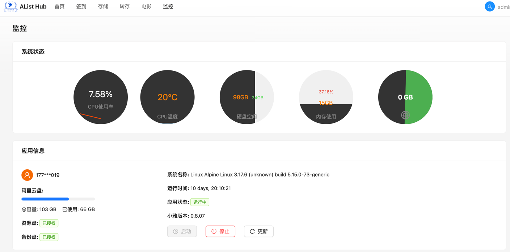

# AList Hub

AList Hub是针对小雅AList做的一个封装,更加方便部署、更新和维护

## 功能特点

- 自动签到
- 引导式使用
- 自动更新小雅数据
- 消息推送到手机
- 支持数据监听,并转存
- 支持挂载第三方站点、阿里云盘分享、WebDav和PikPak
- 电影海报
- 系统监控
- AList主题调整
- 自动索引所有数据(小雅数据+自己添加的挂载点)
- 支持搜索

## 界面展示


<br/>
<br/>

<br/>
<br/>

<br/>
<br/>

<br/>
<br/>

<br/>
<br/>


## 开始使用

### 先决条件

系统安装了docker

### 安装

- 方式1:  使用 `docker-compose.yml`

``` yaml

name: alist-hub  
services:
  alist-hub:
    ports:
      - 5244:80
    volumes:
      - ./.alist_data:/opt/alist/data
      - /mnt/nextcloud/alist:/Downloads
    container_name: alist-hub
    image: aetherlib/alist-hub:latest

```

```shell
$ docker-compose up -d
```

- 方式2: 使用`docker`命令

```shell
$ docker run -d \
  --name alist-hub \
  -p 5244:80 \
  -v $(pwd)/.alist_data:/opt/alist/data \
  -v /mnt/nextcloud/alist:/Downloads \
  aetherlib/alist-hub:latest

```

### 配置

- 通过浏览器访问 `http://localhost:5244/@hub/initial` 进入配置页面,根据提示进行配置即可

### 如何使用转存功能

- 安装Aria2
- 在 头像 → 个人设置 → 下载设置 配置好地址和密钥(可选)

### 其他配置说明

- PikPak: 添加账号后会自动装载小雅的PikPak数据
- PushDeer: 自动推送消息到手机(需打开通知) [注册地址](https://www.pushdeer.com/product.html)

## 贡献

说明如何为项目贡献。通常包括：

- Fork 项目
- 创建您的特性分支 (`git checkout -b feature/AmazingFeature`)
- 提交您的更改 (`git commit -m 'Add some AmazingFeature'`)
- 推送到分支 (`git push origin feature/AmazingFeature`)
- 打开一个 Pull Request

## 许可证

该项目根据 MIT 许可证授权。详情请见 [LICENSE](LICENSE) 文件。

## 联系方式

yanganfu2012@gmail.com

## 致谢

- 小雅AList
- AList